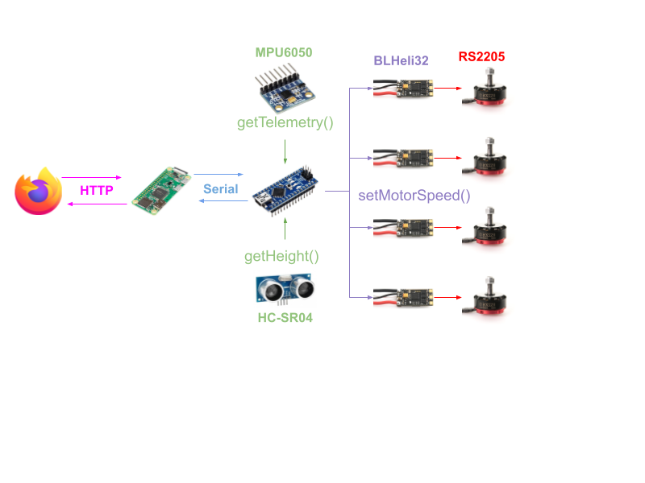

# Raspifly

## Control Diagram

## To-Do Mr. Byrne

1. Create Raspberry Pi Webserver
2. Create Serial Protocol

## To-Do Alex

1. Edit the [Control.h](include/Control.h) file to include a `getHeight()` function
2. Edit the [Control.h](include/Control.h) file to include a `getTelemetry()` function

## To-Do Hein

1. 
